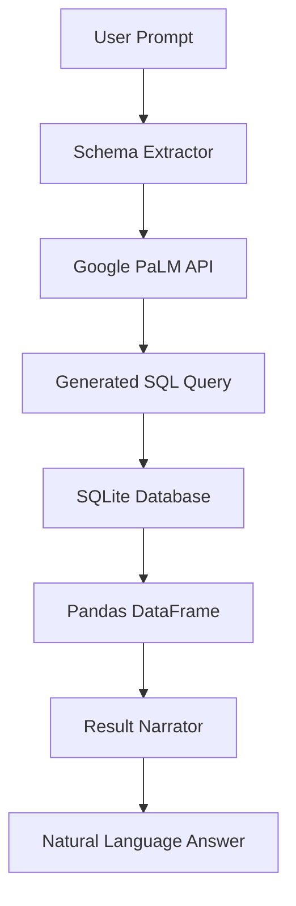

# 🗄️ SQLite Database Explorer & LLM Query Assistant

A powerful **Streamlit** application that bridges the gap between natural language and structured databases. This tool allows users to manage a SQLite database via a clean UI while leveraging **Google Generative AI (PaLM)** to translate plain English prompts into executable SQL queries.

---

## 🏗️ System Architecture

The application follows a **Hybrid Data Management** architecture, combining traditional CRUD operations with an AI-driven inference layer.

### 1. Persistent Storage Layer
* **Engine:** SQLite3
* **Schema Management:** Automated table creation and dynamic schema discovery using `PRAGMA table_info`.
* **Data Handling:** Integrated with **Pandas** for efficient SQL-to-DataFrame conversion and UI rendering.

### 2. AI Logic Layer (Text-to-SQL)
* **LLM Engine:** Google Generative AI (`text-bison`).
* **Context Injection:** The system automatically extracts the table schema (column names and types) and injects it into the prompt. This ensures the LLM generates accurate queries that reference actual existing columns.
* **Natural Language Interpretation:** After executing a query, the system passes the raw result back to the LLM to generate a human-readable summary of the data.

### 3. UI/UX Layer
* **CRUD Interface:** Form-based data entry for employee records.
* **Dynamic Exploration:** Selectboxes to switch between different tables within the database.
* **Dual-Mode Querying:** * **LLM Mode:** Natural language prompts.
    * **Developer Mode:** Direct SQL command execution.

---

## 🛠️ Tech Stack

| Layer | Technology |
| :--- | :--- |
| **Frontend** | Streamlit |
| **Database** | SQLite3 |
| **AI/LLM** | Google PaLM API (`google-generativeai`) |
| **Data Analysis** | Pandas |

---

## 🧠 Core Features

* **Auto-Schema Discovery:** No need to remember column names; the AI learns them automatically from the DB metadata.
* **Dynamic Table Creation:** Enter a new table name in the form, and the system initializes the SQLite schema on-the-fly.
* **Conversational Results:** Instead of just showing a table, the app uses AI to say: *"There are 5 employees in the Sales department with a total salary of $250,000."*
* **Safety & Preview:** Generated SQL is displayed in a code block for review before execution results are shown.

---

## 📋 Logic Workflow

1. **Connect:** User enters a database name. The app connects or creates a new `.db` file.
2. **Input:** Data is entered via a Streamlit form and committed to SQLite.
3. **Prompt:** User asks: *"Who is the highest paid person in Engineering?"*
4. **Translate:** PaLM receives the question + table schema → Generates `SELECT name FROM employees WHERE department='Engineering' ORDER BY salary DESC LIMIT 1`.
5. **Execute:** Pandas runs the query against the local SQLite instance.
6. **Narrate:** PaLM interprets the resulting dataframe and provides a natural language answer.

---

### 📈 Operational Data Flow

---
**Note:** *This application requires a valid Google API Key configured within the `get_palm_response` function to enable AI features.*
